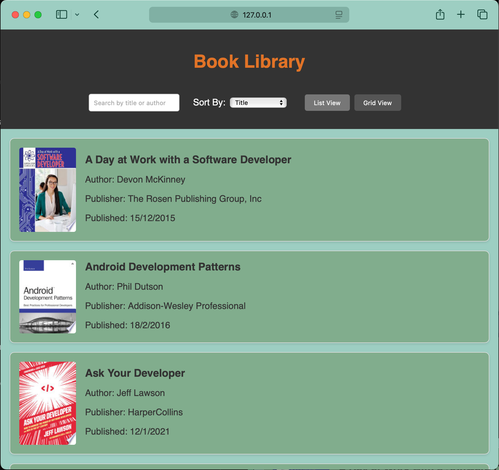
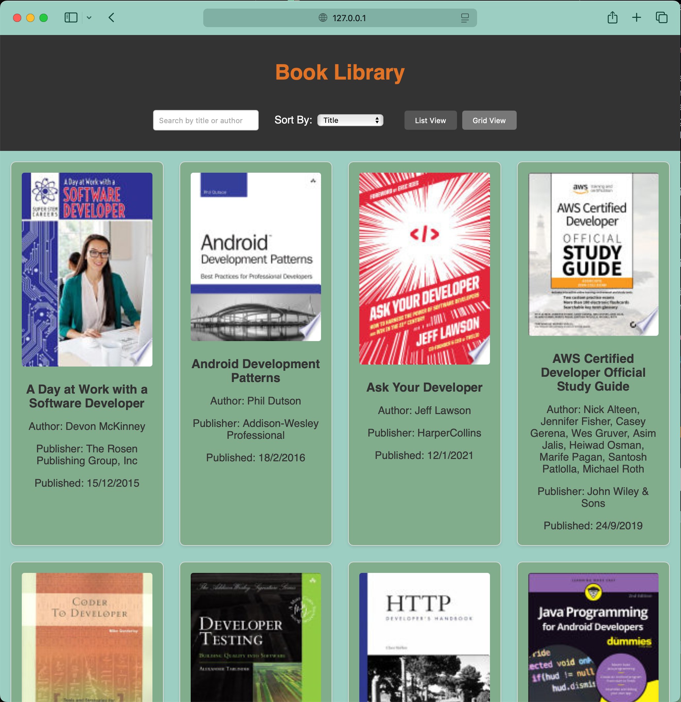
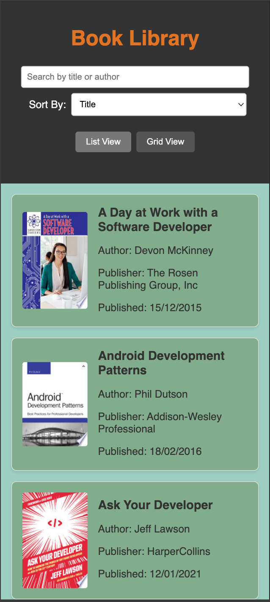

# Book Library

## Description

This is a simple web application that displays a collection of books. Users can search for books by title or author, sort the results by title or release date, and switch between list and grid views. The application fetches book data from the [FreeAPI Books API](https://api.freeapi.app/api/v1/public/books).

## Deployment Link

[Live Demo](https://suuumans.github.io/book-library/) 


## Features

-   **Search:** Find books by title or author.
-   **Sort:** Order books by title or release date.
-   **View:** Switch between list and grid display modes.
-   **Pagination:** Loads more books as the user scrolls down.
-   **Details:** Clicking on a book opens its Google Books page in a new tab.

## Screenshots

**List View:**



**Grid View:**



**Mobile View:**




## Installation

To run this application locally, follow these steps:

1.  Clone the repository:

    ```bash
    git clone https://github.com/suuumans/book-library.git
    ```

2.  Open the `index.html` file in your web browser.

## Technologies Used

-   HTML
-   CSS
-   JavaScript
-   FreeAPI Books API

## Contributing

Pull requests are welcome. For major changes, please open an issue first to discuss what you would like to change.

## License

[MIT](https://choosealicense.com/licenses/mit/)

---
[Suman Sarkar](https://x.com/suuumans/)
